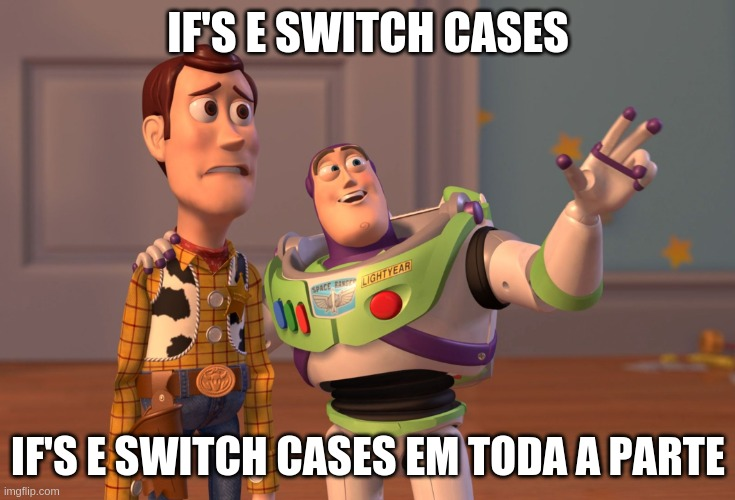

<p align="center">
    
</p>

# Removendo excesso de if's e cases do algoritmo

## Introdução
Normalmente durante a execução de algum algoritmo, precisamos verificar algumas condições para poder desviar o fluxo do programa para atender determinadas codições, para isso usamos o if para poder seguir um novo fluxo, ou quando esperamos determinados valores usamos o switch para executar determinada clausula case. Até aí não existe nenhum problema, mas quando surge a necessidade de adicionar um novo if/case quando se há um novo valor esperado, isso aumenta o número de if/case utilizado resultando em um algoritmo difícil de ler devido à quantidade de fluxos que o programa pode tomar durante sua execução, em qualidade de código isso gera um problema de Complexidade ciclomática, sendo a quantidade de caminhos um programa pode seguir. Nesse artigo é demonstrado como reduzir a quantidade de if's/cases do algoritmo assim separando de forma organizada o processamento em função da entrada fornecida. Para demonstrar, implementaremos uma calculadora aritmética simples, onde com dois números podemos realizar as operações básicas +-*/.

## Implementação usando if
Nessa primeira versão usaremos o if para realizar a seleção das operações
```c
#include <stdio.h>
#include <stdlib.h>

int main()
{
    double number1, number2, result;
    char operation;
    printf("Entre com o 1º número: ");
    scanf("%lf", &number1);
    getchar();
    printf("Entre com a operação: ");
    scanf("%c", &operation);
    printf("Entre com o 2º número: ");
    scanf("%lf", &number2);

    if(operation == '+')
    {
        result =  number1 + number2;
        printf("%lf + %lf = %lf\n", number1, number2, result);
    }

    else if(operation == '-')
    {
        result =  number1 - number2;
        printf("%lf - %lf = %lf\n", number1, number2, result);
    }

    else if(operation == '/')
    {
        result =  number1 / number2;
        printf("%lf / %lf = %lf\n", number1, number2, result);
    }

    else if(operation == '*')
    {
        result =  number1 * number2;
        printf("%lf * %lf = %lf\n", number1, number2, result);
    }

    else 
        printf("Operação não permitida\n");

    return 0;
}
```

Nessa primeira versão podemos notar o seguinte, para cada operação precisamos adicionar um novo if e verificar se o simbolo corresponde à entrada, caso sim realizamos o processamento. Agora vamos adicionar uma nova operação por exemplo exponenciação, então adicionamos um novo if, assim fica da seguinte forma:
```c
#include <stdio.h>
#include <stdlib.h>

int main()
{
    double number1, number2, result;
    char operation;
    printf("Entre com o 1º número: ");
    scanf("%lf", &number1);
    getchar();
    printf("Entre com a operação: ");
    scanf("%c", &operation);
    printf("Entre com o 2º número: ");
    scanf("%lf", &number2);

    if(operation == '+')
    {
        result =  number1 + number2;
        printf("%lf + %lf = %lf\n", number1, number2, result);
    }

    else if(operation == '-')
    {
        result =  number1 - number2;
        printf("%lf - %lf = %lf\n", number1, number2, result);
    }

    else if(operation == '/')
    {
        result =  number1 / number2;
        printf("%lf / %lf = %lf\n", number1, number2, result);
    }

    else if(operation == '*')
    {
        result =  number1 * number2;
        printf("%lf * %lf = %lf\n", number1, number2, result);
    }

    else if(operation == '^')
    {   
        result = 1;
        for(int i = 1; i <= number2; i++)
            result *= number1;
        printf("%lf ^ %lf = %lf\n", number1, number2, result);
    }

    else 
        printf("Operação não permitida\n");

    return 0;
}
```
Podemos notar que o algoritmo começa a ficar maior, e devido à isso começamos a não ter a visão de toda a implementação, nos fazendo rolar a barra lateral para poder ver todo o algoritmo. Imagine se houver 10 ou 50 if's, o entendimento desse algoritmo fica comprometido devido a extensão do arquivo, porque passaremos mais tempo usando o mouse do que lendo e entendendo o algoritmo ali implementado.

## Implementação usando switch case
Nessa segunda versão usaremos o switch case para realizar a seleção das operações

```c
#include <stdio.h>
#include <stdlib.h>

int main()
{
    double number1, number2, result;
    char operation;
    printf("Entre com o 1º número: ");
    scanf("%lf", &number1);
    getchar();
    printf("Entre com a operação: ");
    scanf("%c", &operation);
    printf("Entre com o 2º número: ");
    scanf("%lf", &number2);

    switch(operation)
    {
        case '+':
            result =  number1 + number2;
            printf("%lf + %lf = %lf\n", number1, number2, number1 + number2);
            break;

        case '-':
            result =  number1 + number2;
            printf("%lf - %lf = %lf\n", number1, number2, number1 - number2);
            break;

        case '/':
            result =  number1 + number2;
            printf("%lf / %lf = %lf\n", number1, number2, number1 / number2);
            break;

        case '*':
            result =  number1 + number2;
            printf("%lf * %lf = %lf\n", number1, number2, number1 * number2);
            break;

        default:
            printf("Operação não permitida\n");

    }        

    return 0;
}
```
Nessa segunda versão notamos uma melhora em relação ao tamanho da primeira versão, o algoritmo está mais agradável de ser lido, porém exercitemos o mesmo exemplo da primeira versão, adicionaremos a exponenciação, ou seja, devemos adicionar mais uma cláusula case para isso ficando da seguinte forma:

```c
#include <stdio.h>
#include <stdlib.h>

int main()
{
    double number1, number2, result;
    char operation;
    printf("Entre com o 1º número: ");
    scanf("%lf", &number1);
    getchar();
    printf("Entre com a operação: ");
    scanf("%c", &operation);
    printf("Entre com o 2º número: ");
    scanf("%lf", &number2);

    switch(operation)
    {
        case '+':
            result =  number1 + number2;
            printf("%lf + %lf = %lf\n", number1, number2, number1 + number2);
            break;

        case '-':
            result =  number1 + number2;
            printf("%lf - %lf = %lf\n", number1, number2, number1 - number2);
            break;

        case '/':
            result =  number1 + number2;
            printf("%lf / %lf = %lf\n", number1, number2, number1 / number2);
            break;

        case '*':
            result =  number1 + number2;
            printf("%lf * %lf = %lf\n", number1, number2, number1 * number2);
            break;

        case '^':
            result = 1;
            for(int i = 1; i <= number2; i++)
                result *= number1;

            printf("%lf ^ %lf = %lf\n", number1, number2, result);
            break;

        default:
            printf("Operação não permitida\n");

    }        

    return 0;
}
```

Apesar de o algoritmo estar mais agradável para se ler, já começamos a necessitar rolar para termos o total entendimento, resultando assim novamente em gastar mais tempo manipulando o mouse do que de fato entendendo o algoritmo ali implementado. Mas como implementar um algoritmo sem tantos if's ou cases? Bom responderemos no próximo tópico.

## Absorvendo if's e cases
Para implementar um algoritmo com poucos if's e cases, precisamos utilizar o recurso de mapeamento, onde atráves de uma estrutura contendo um atributo que é responsável por mapear o simbolo no qual será comparado, e um callback que será executado quando o simbolo de entrada corresponder ao simbolo comparado, vejamos isso na prática.

Para que possamos realizar tal mapeamento precisamos definir uma callback, que não devolve nada e que recebe dois argumentos do tipo double, argumentos esses utilizados para realizar o cálculo com a operação realizada.
```c
typedef void (*Execute)(double n1, double n2);
```

E também precisamos definir a estrutura que irá corresponder ao mapeamento que será realizado, ficando da seguinte forma
```c
typedef struct
{
    char operation;
    Execute exec;
} DoMath;
```

Com a definição do callback é possível implementar as funções que realizarão as operações, sendo:
```c
void Sum(double n1, double n2)
{
    printf("%lf + %lf = %lf\n", n1, n2, n1 + n2);    
}

void Subtract(double n1, double n2)
{
    printf("%lf - %lf = %lf\n", n1, n2, n1 - n2);
}

void Divide(double n1, double n2)
{
    printf("%lf / %lf = %lf\n", n1, n2, n1 / n2);
}

void Multiply(double n1, double n2)
{
    printf("%lf * %lf = %lf\n", n1, n2, n1 * n2);
}
```

Com as funções definidas podemos iniciar o mapeamento, para cada operação temos agora uma função responsável por executar essa operação, assim criamos um array da estrutura DoMath

```c
DoMath do_math[] = 
{
    {.operation = '+', .exec = Sum},
    {.operation = '-', .exec = Subtract},
    {.operation = '/', .exec = Divide},
    {.operation = '*', .exec = Multiply}
};
```

Para processar esse mapeameto, precisamos saber a quantidade de items que esse array possui então calculamos da seguinte forma:

```c
int do_math_items = sizeof(do_math) / sizeof(do_math[0]);
```

E a rotina do processamento propriamente dito, usamos um for, que carinhosamente apelidei de for primordial, onde somente ele é capaz de processar todo o mapeamento independente que quantos items possa ter.

```c
for(int i = 0; i < do_math_items; i++)
{
    if(operation == do_math[i].operation)
    {
        do_math[i].exec(number1, number2);
        return 0;
    }
}
```
Assim se a operação selecionada corresponder à algum item do array o if será verdadeiro e executará o callback à ele associado, a listagem completa vem a seguir
```c
#include <stdio.h>
#include <stdlib.h>

typedef void (*Execute)(double n1, double n2);

typedef struct
{
    char operation;
    Execute exec;
} DoMath;

void Sum(double n1, double n2)
{
    printf("%lf + %lf = %lf\n", n1, n2, n1 + n2);    
}

void Subtract(double n1, double n2)
{
    printf("%lf - %lf = %lf\n", n1, n2, n1 - n2);
}

void Divide(double n1, double n2)
{
    printf("%lf / %lf = %lf\n", n1, n2, n1 / n2);
}

void Multiply(double n1, double n2)
{
    printf("%lf * %lf = %lf\n", n1, n2, n1 * n2);
}

int main()
{
    DoMath do_math[] = 
    {
        {.operation = '+', .exec = Sum},
        {.operation = '-', .exec = Subtract},
        {.operation = '/', .exec = Divide},
        {.operation = '*', .exec = Multiply}
    };

    int do_math_items = sizeof(do_math) / sizeof(do_math[0]);

    double number1, number2, result;
    char operation;
    printf("Entre com o 1º número: ");
    scanf("%lf", &number1);
    getchar();
    printf("Entre com a operação: ");
    scanf("%c", &operation);
    printf("Entre com o 2º número: ");
    scanf("%lf", &number2);

    for(int i = 0; i < do_math_items; i++)
    {
        if(operation == do_math[i].operation)
        {
            do_math[i].exec(number1, number2);
            return 0;
        }
    }

    printf("Operação não permitida\n");

    return 0;
}
```
Para completarmos vamos adicionar a exponenciação, assim como foi feito nos exemplos anteriores

```c
void Power(double n1, double n2)
{
    double result = 1;
    for (int i = 1; i <= n2; i++)
        result *= n1;

    printf("%lf ^ %lf = %lf\n", n1, n2, result);
}
```

Adicionamos na tabela e voilá, nada muda.

```c
DoMath do_math[] = 
{
    {.operation = '+', .exec = Sum},
    {.operation = '-', .exec = Subtract},
    {.operation = '/', .exec = Divide},
    {.operation = '*', .exec = Multiply},
    {.operation = '^', .exec = Power}
};
```

A listagem completa com a exponenciação
```c
#include <stdio.h>
#include <stdlib.h>

typedef void (*Execute)(double n1, double n2);

typedef struct
{
    char operation;
    Execute exec;
} DoMath;

void Sum(double n1, double n2)
{
    printf("%lf + %lf = %lf\n", n1, n2, n1 + n2);    
}

void Subtract(double n1, double n2)
{
    printf("%lf - %lf = %lf\n", n1, n2, n1 - n2);
}

void Divide(double n1, double n2)
{
    printf("%lf / %lf = %lf\n", n1, n2, n1 / n2);
}

void Multiply(double n1, double n2)
{
    printf("%lf * %lf = %lf\n", n1, n2, n1 * n2);
}

void Power(double n1, double n2)
{
    double result = 1;
    for (int i = 1; i <= n2; i++)
        result *= n1;

    printf("%lf ^ %lf = %lf\n", n1, n2, result);
}

int main()
{
    DoMath do_math[] = 
    {
        {.operation = '+', .exec = Sum},
        {.operation = '-', .exec = Subtract},
        {.operation = '/', .exec = Divide},
        {.operation = '*', .exec = Multiply},
        {.operation = '^', .exec = Power}
    };

    int do_math_items = sizeof(do_math) / sizeof(do_math[0]);

    double number1, number2, result;
    char operation;
    printf("Entre com o 1º número: ");
    scanf("%lf", &number1);
    getchar();
    printf("Entre com a operação: ");
    scanf("%c", &operation);
    printf("Entre com o 2º número: ");
    scanf("%lf", &number2);

    for(int i = 0; i < do_math_items; i++)
    {
        if(operation == do_math[i].operation)
        {
            do_math[i].exec(number1, number2);
            return 0;
        }
    }

    printf("Operação não permitida\n");

    return 0;
}
```

## Conclusão
O uso de switch case e de if's é interessante quando há poucas comparações, porém quando em excesso pode provocar perda na produtividade e no entendimento do algoritmo, o modelo apresentando permite uma separação mais organizada, onde por meio da tabela é possível verificar qual função será executada para aquele determinado símbolo, facilitando assim a modularização, já que estão encapsuladas em funções, um outro ponto interessante é, que com esse modelo foi criado um framework para essa aplicação, onde para cada nova função criada, precisamos somente mapear qual vai ser o símbolo que vai corresponder a essa função, não necessitando alterar mais nada na aplicação.
